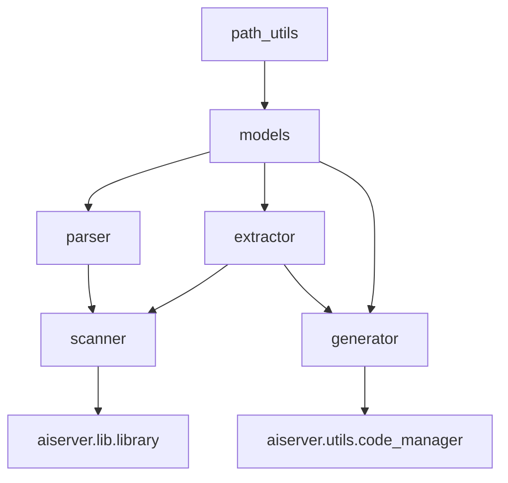
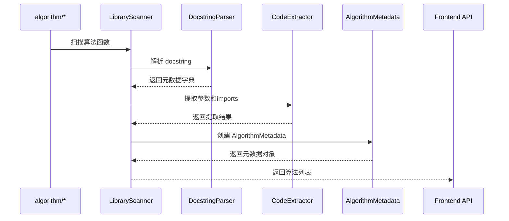

# Core 算法核心库

> **版本**: 1.0  
> **创建时间**: 2024-12-14  
> **用途**: 统一的算法解析、生成和扫描核心模块

## 📋 概述

`library/core` 是 JuServer 项目的算法核心库，提供了算法元数据管理、代码生成、代码解析和库扫描等核心功能。它是整个算法系统的基础，被 `aiserver` 后端和 `algorithm` 库广泛使用。

### 设计原则

1. **单一职责**: 每个模块负责特定的功能
2. **DRY 原则**: 消除代码重复，统一实现逻辑
3. **可测试性**: 独立的模块便于单元测试
4. **易扩展性**: 清晰的接口便于功能扩展
5. **类型安全**: 使用 dataclass 和类型注解

## 🏗️ 架构设计

### 模块结构

```
library/core/
├── __init__.py           # 模块导出和路径初始化
├── models.py             # 数据模型定义
├── parser.py             # Docstring 解析器
├── extractor.py          # 代码提取器
├── scanner.py            # 算法库扫描器
├── generator.py          # 代码生成器
├── path_utils.py         # 路径管理工具
└── README.md            # 本文档
```

### 模块依赖关系



### 数据流



## 📦 核心模块

### 1. models.py - 数据模型

定义算法相关的数据结构。

#### 主要类

**`AlgorithmPort`**
- 表示算法的输入/输出端口
- 字段: `name`, `type`, `description`

**`AlgorithmParameter`**
- 表示算法参数
- 字段: `name`, `type`, `default`, `label`, `description`, `widget`, `options`, `priority`, `role` 等

**`AlgorithmMetadata`**
- 算法元数据的核心模型
- 字段: `id`, `name`, `category`, `description`, `prompt`, `template`, `imports`, `parameters`, `inputs`, `outputs`, `node_type`
- 方法: 
  - `to_dict()`: 转换为字典格式（前端 API）
  - `from_dict()`: 从字典创建实例

**工具函数**
- `get_category_labels()`: 获取分类标签映射

#### 示例

```python
from core import AlgorithmMetadata, AlgorithmParameter, AlgorithmPort

# 创建算法元数据
metadata = AlgorithmMetadata(
    id='my_algorithm',
    name='我的算法',
    category='data_operation',
    description='这是一个示例算法',
    parameters=[
        AlgorithmParameter(
            name='threshold',
            type='float',
            default=0.5,
            label='阈值'
        )
    ],
    inputs=[
        AlgorithmPort(
            name='data',
            type='DataFrame',
            description='输入数据'
        )
    ],
    outputs=[
        AlgorithmPort(
            name='result',
            type='DataFrame',
            description='处理结果'
        )
    ]
)

# 转换为字典
dict_data = metadata.to_dict()

# 从字典创建
metadata2 = AlgorithmMetadata.from_dict(dict_data)
```

### 2. parser.py - Docstring 解析器

解析算法函数的 docstring，提取元数据。

#### 主要类

**`DocstringParser`**
- 解析 Google 风格的 docstring
- 提取 Algorithm 块、Parameters 块、Returns 块

**`CodeParser`**
- 解析完整的函数代码
- 整合 AST 解析、Docstring 解析和 Import 提取

#### 支持的格式

```python
def my_algorithm(data: pd.DataFrame, threshold: float = 0.5) -> pd.DataFrame:
    """
    算法描述
    
    Algorithm:
        name: 我的算法
        category: data_operation
        prompt: 处理数据的算法
        imports:
            - pandas as pd
            - numpy as np
    
    Parameters:
        threshold (float): 阈值参数
            - widget: slider
            - min: 0.0
            - max: 1.0
            - priority: critical
    
    Returns:
        DataFrame: 处理后的数据
    """
    # ... 函数实现
```

#### 示例

```python
from core import DocstringParser, CodeParser

# 解析 docstring
parser = DocstringParser()
result = parser.parse(docstring)

print(result['algorithm'])    # 算法元数据
print(result['parameters'])   # 参数元数据
print(result['returns'])      # 返回值元数据

# 解析完整代码
code_parser = CodeParser()
metadata = code_parser.parse_function_code(code)

# 或使用便捷函数
from core import parse_function_code
metadata = parse_function_code(code)
```

### 3. extractor.py - 代码提取器

从函数源码中提取各种信息。

#### 主要类

**`CodeExtractor`**
- 提取函数参数
- 提取导入语句
- 提取函数体
- 提取返回值类型

#### 示例

```python
from core import CodeExtractor
import inspect

extractor = CodeExtractor()

# 提取参数
def my_func(data: pd.DataFrame, threshold: float = 0.5):
    pass

params = extractor.extract_parameters(my_func, {})
print(params)  # [AlgorithmParameter(...), ...]

# 提取函数体
source = inspect.getsource(my_func)
body = extractor.extract_function_body(source)

# 提取导入
import algorithm.eda.summary_stats as module
imports = extractor.extract_imports_from_module(module)
print(imports)  # ['pandas as pd', 'numpy as np', ...]
```

### 4. scanner.py - 算法库扫描器

扫描 Python 包，提取所有算法元数据。

#### 主要类

**`LibraryScanner`**
- 扫描包中所有算法函数
- 构建算法元数据列表
- 支持按分类或标签组织

#### 示例

```python
from core import LibraryScanner
import algorithm

# 创建扫描器
scanner = LibraryScanner(algorithm)

# 按分类扫描
by_category = scanner.scan()
print(by_category.keys())  # ['load_data', 'eda', 'data_operation', ...]

# 按标签扫描（中文）
by_label = scanner.scan_with_labels()
print(by_label.keys())  # ['输入输出', '探索式分析', '数据操作', ...]

# 获取所有算法
all_algos = scanner.get_all_algorithms()

# 按ID获取
algo = scanner.get_algorithm_by_id('load_csv')
```

### 5. generator.py - 代码生成器

根据算法元数据生成 Python 函数代码。

#### 主要类

**`CodeGenerator`**
- 生成完整的函数代码
- 包含导入、签名、docstring、函数体
- 支持保留现有函数体

#### 示例

```python
from core import CodeGenerator, AlgorithmMetadata

generator = CodeGenerator()

# 创建元数据
metadata = AlgorithmMetadata(
    id='process_data',
    name='数据处理',
    category='data_operation',
    imports=['pandas as pd'],
    parameters=[...],
    inputs=[...],
    outputs=[...]
)

# 生成代码
code = generator.generate_function_code(metadata)
print(code)

# 生成时保留现有函数体
code_with_body = generator.generate_function_code(
    metadata, 
    existing_body='    return data.dropna()'
)
```

### 6. path_utils.py - 路径管理工具

统一管理 library 路径，确保模块正确导入。

#### 主要函数

**`get_library_path()`**
- 获取 library 目录的绝对路径

**`ensure_library_in_path()`**
- 确保 library 在 sys.path 中
- 幂等操作，可多次调用

#### 特性

- **自动初始化**: 导入 core 模块时自动执行
- **全局单例**: 使用全局变量缓存路径
- **线程安全**: 使用标志位避免重复初始化

#### 示例

```python
from core import ensure_library_in_path, get_library_path

# 获取路径
lib_path = get_library_path()
print(lib_path)  # /path/to/JuServer/library

# 确保路径在 sys.path 中
ensure_library_in_path()

# 导入 core 任意模块都会自动初始化路径
from core import LibraryScanner  # 路径已自动设置
```

## 🔌 与 aiserver 的集成

### 使用场景

#### 1. 获取算法库列表

**文件**: `aiserver/aiserver/lib/library.py`

```python
from core import LibraryScanner, get_category_labels
import algorithm

def get_library_metadata():
    scanner = LibraryScanner(algorithm)
    metadata_by_label = scanner.scan_with_labels(algorithm)
    
    library = {}
    for label, algos in metadata_by_label.items():
        library[label] = [algo.to_dict() for algo in algos]
    
    return library
```

#### 2. 生成算法代码

**文件**: `aiserver/aiserver/utils/code_manager.py`

```python
from core import AlgorithmMetadata, CodeGenerator
from core.extractor import CodeExtractor

def generate_function_code(metadata: dict, existing_code: str = None) -> str:
    # 转换为 AlgorithmMetadata
    algo_metadata = AlgorithmMetadata.from_dict(metadata)
    
    # 提取现有函数体
    existing_body = None
    if existing_code:
        extractor = CodeExtractor()
        existing_body = extractor.extract_function_body(existing_code)
    
    # 生成代码
    generator = CodeGenerator()
    return generator.generate_function_code(algo_metadata, existing_body)
```

#### 3. 解析算法代码

**文件**: `aiserver/aiserver/utils/code_manager.py`

```python
from core import parse_function_code

def parse_function_code_api(code: str) -> dict:
    return parse_function_code(code)
```

#### 4. 算法热更新

**文件**: `aiserver/aiserver/utils/reload_helper.py`

```python
import importlib
import sys

def reload_algorithm_modules():
    importlib.invalidate_caches()
    
    # 重载 algorithm.* 子模块
    for name in list(sys.modules.keys()):
        if name.startswith('algorithm.'):
            importlib.reload(sys.modules[name])
    
    # 重载主模块
    if 'algorithm' in sys.modules:
        importlib.reload(sys.modules['algorithm'])
```

## 📚 完整使用示例

### 示例 1: 扫描算法库

```python
from core import LibraryScanner
import algorithm

# 创建扫描器
scanner = LibraryScanner(algorithm)

# 扫描所有算法
metadata_by_label = scanner.scan_with_labels()

# 显示统计
print(f"找到 {len(metadata_by_label)} 个分类:")
for label, algos in metadata_by_label.items():
    print(f"  - {label}: {len(algos)} 个算法")
    for algo in algos[:2]:  # 显示前2个
        print(f"    • {algo.id}: {algo.name}")
```

### 示例 2: 生成新算法

```python
from core import AlgorithmMetadata, AlgorithmParameter, CodeGenerator

# 定义算法元数据
metadata = AlgorithmMetadata(
    id='filter_outliers',
    name='过滤异常值',
    category='data_preprocessing',
    description='移除数据中的异常值',
    imports=['pandas as pd', 'numpy as np'],
    parameters=[
        AlgorithmParameter(
            name='method',
            type='str',
            default='iqr',
            label='检测方法',
            widget='select',
            options=['iqr', 'zscore', 'isolation_forest']
        ),
        AlgorithmParameter(
            name='threshold',
            type='float',
            default=3.0,
            label='阈值',
            widget='slider',
            min=1.0,
            max=5.0
        )
    ]
)

# 生成代码
generator = CodeGenerator()
code = generator.generate_function_code(metadata)

print(code)
```

### 示例 3: 解析现有算法

```python
from core import parse_function_code

# 读取算法代码
with open('library/algorithm/eda/summary_stats.py', 'r') as f:
    code = f.read()

# 解析
metadata = parse_function_code(code)

if metadata:
    print(f"算法ID: {metadata['id']}")
    print(f"算法名称: {metadata['name']}")
    print(f"分类: {metadata['category']}")
    print(f"参数数量: {len(metadata['args'])}")
    print(f"Imports: {metadata['imports']}")
```

### 示例 4: 自定义扫描

```python
from core import LibraryScanner
import algorithm

scanner = LibraryScanner(algorithm)

# 扫描单个模块
import algorithm.eda.summary_stats as module
algos = scanner.scan_module(module)

# 从函数创建元数据
def my_custom_algo(data):
    """
    自定义算法
    
    Algorithm:
        name: 我的算法
        category: custom
    """
    return data

metadata = scanner.create_metadata_from_func(my_custom_algo)
```

## 🧪 测试

### 运行测试

Core 模块的测试脚本位于 `utilstools/` 目录：

```bash
# 测试代码生成
python utilstools/test_code_generation.py

# 测试代码解析
python utilstools/test_code_parsing.py

# 测试核心扫描
python utilstools/test_core_scan.py

# 测试路径初始化
python utilstools/test_path_init.py
```

### 测试覆盖

- ✅ 数据模型转换 (`models.py`)
- ✅ Docstring 解析 (`parser.py`)
- ✅ 代码提取 (`extractor.py`)
- ✅ 算法扫描 (`scanner.py`)
- ✅ 代码生成 (`generator.py`)
- ✅ 路径管理 (`path_utils.py`)

## 🔧 开发指南

### 添加新功能

1. **添加新的参数类型**
   - 修改 `models.py` 中的 `AlgorithmParameter`
   - 更新 `generator.py` 中的代码生成逻辑
   - 更新前端对应的组件

2. **支持新的 Docstring 格式**
   - 修改 `parser.py` 中的解析逻辑
   - 添加相应的测试用例

3. **扩展扫描功能**
   - 在 `scanner.py` 中添加新的扫描方法
   - 更新 `LibraryScanner` 类

### 代码规范

- 使用 Python 3.8+ 特性
- 使用 dataclass 定义数据模型
- 使用类型注解
- 编写 docstring（Google 风格）
- 保持函数职责单一

### 性能优化

- 扫描结果使用缓存 (`scanner._cache`)
- 路径初始化使用全局变量
- 避免重复解析相同的代码

## 📊 统计信息

### 代码规模

| 模块 | 行数 | 主要类/函数 |
|-----|------|-----------|
| models.py | ~270 | 3 个类 + 工具函数 |
| parser.py | ~580 | 2 个类 |
| extractor.py | ~410 | 1 个类 |
| scanner.py | ~270 | 1 个类 |
| generator.py | ~350 | 1 个类 |
| path_utils.py | ~70 | 2 个函数 |
| **总计** | **~1950** | **10 个类/模块** |

### 重构成果

通过创建 core 模块，我们：

- ✅ 删除了约 **416 行**重复代码
- ✅ 统一了 **5 个**核心功能模块
- ✅ 提高了代码可维护性和可测试性
- ✅ 简化了 `aiserver` 的实现

## 🔗 相关文档

- [算法开发指南](../../docs/algorithm_development_guide.md)
- [算法解析重构方案](../../docs/algorithm_parsing_refactoring_proposal.md)
- [第二阶段重构任务](../../docs/algorithm_refactoring_phase2_tasks.md)
- [任务完成总结](../../docs/task3_completion_summary.md)

## 📝 更新日志

### v1.0 (2024-12-14)

**新增**:
- 创建完整的 core 模块架构
- 实现 6 个核心子模块
- 添加完整的 API 文档
- 创建测试脚本

**重构**:
- 统一代码生成逻辑
- 统一代码解析逻辑
- 统一路径管理逻辑
- 统一模块重载逻辑

**优化**:
- 删除 416 行重复代码
- 提高代码复用性
- 改善可维护性

---

**维护者**: JuServer Team  
**最后更新**: 2024-12-14
